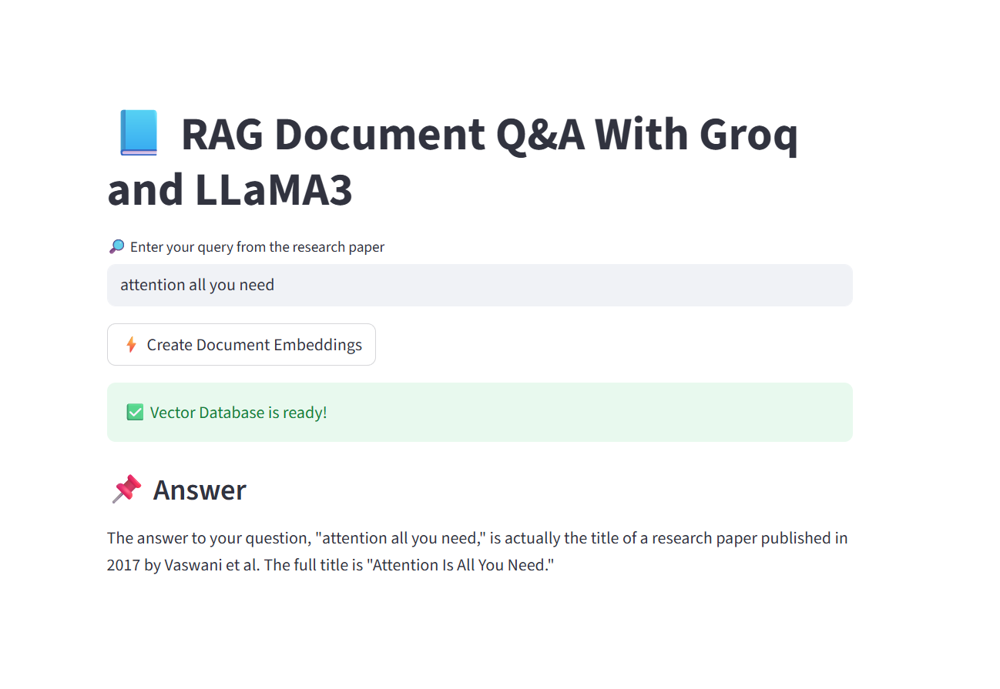

# 🧠 Intelligent Document Q&A Assistant

A powerful RAG (Retrieval-Augmented Generation) application that enables intelligent question-answering over your PDF documents using Groq's LLaMA 3.1 and advanced embedding techniques.




## ✨ Features

- 📄 **PDF Document Processing** - Automatically loads and processes multiple PDF documents
- 🔍 **Semantic Search** - Uses FAISS vector store for efficient similarity search
- 🤖 **AI-Powered Responses** - Leverages Groq's LLaMA 3.1 8B model for intelligent answers
- 🎨 **Beautiful UI** - Modern, gradient-styled interface with smooth animations
- 📊 **Real-time Statistics** - Track document count, chunks, and processing status
- ⚡ **Fast Performance** - Optimized with caching and efficient embedding models
- 💡 **Query Suggestions** - Pre-built question templates to get started quickly

## 🚀 Quick Start

### Prerequisites

- Python 3.8 or higher
- Groq API Key ([Get one here](https://console.groq.com))
- HuggingFace Token ([Get one here](https://huggingface.co/settings/tokens))

### Installation

1. **Clone the repository**
```bash
git clone https://github.com/yourusername/rag-document-qa.git
cd rag-document-qa
```

2. **Create a virtual environment**
```bash
python -m venv venv
source venv/bin/activate  # On Windows: venv\Scripts\activate
```

3. **Install dependencies**
```bash
pip install -r requirements.txt
```

4. **Set up environment variables**

Create a `.env` file in the root directory:
```env
GROQ_API_KEY=your_groq_api_key_here
HF_TOKEN=your_huggingface_token_here
```

5. **Add your PDF documents**

Create a `research_papers` folder and add your PDF files:
```bash
mkdir research_papers
# Add your PDF files to this folder
```

6. **Run the application**
```bash
streamlit run app.py
```

The app will open in your browser at `http://localhost:8501`

## 📋 Requirements

Create a `requirements.txt` file with:

```txt
streamlit>=1.28.0
langchain>=0.1.0
langchain-groq>=0.0.1
langchain-openai>=0.0.2
langchain-community>=0.0.13
langchain-huggingface>=0.0.1
faiss-cpu>=1.7.4
pypdf>=3.17.0
python-dotenv>=1.0.0
```

## 🎯 Usage

1. **Initialize Knowledge Base**
   - Click the "🚀 Initialize Knowledge Base" button in the sidebar
   - Wait for documents to be processed and embedded
   - Progress indicators will show the processing stages

2. **Ask Questions**
   - Type your question in the text area
   - Use the query suggestions for inspiration
   - Get AI-generated answers based on your documents

3. **Review Results**
   - View the AI response with context
   - Check document statistics in the sidebar
   - Expand source documents to see what was used

## 🏗️ Architecture

```
┌─────────────────┐
│  PDF Documents  │
└────────┬────────┘
         │
         ▼
┌─────────────────┐
│  PyPDF Loader   │
└────────┬────────┘
         │
         ▼
┌─────────────────┐
│ Text Splitting  │
│  (Recursive)    │
└────────┬────────┘
         │
         ▼
┌─────────────────┐
│  HuggingFace    │
│   Embeddings    │
└────────┬────────┘
         │
         ▼
┌─────────────────┐
│  FAISS Vector   │
│     Store       │
└────────┬────────┘
         │
         ▼
┌─────────────────┐
│   Retrieval     │
│     Chain       │
└────────┬────────┘
         │
         ▼
┌─────────────────┐
│  Groq LLaMA 3.1 │
│      Model      │
└────────┬────────┘
         │
         ▼
┌─────────────────┐
│  Final Answer   │
└─────────────────┘
```

## ⚙️ Configuration

### Advanced Settings (Available in Sidebar)

- **Chunk Size**: 500-2000 characters (default: 1000)
- **Chunk Overlap**: 50-400 characters (default: 200)
- **Max Documents**: 10-100 documents (default: 50)

### Model Configuration

The app uses:
- **LLM**: Groq LLaMA 3.1 8B Instant
- **Embeddings**: HuggingFace all-MiniLM-L6-v2
- **Vector Store**: FAISS (CPU version)

## 🛠️ Customization

### Changing the LLM Model

```python
llm = ChatGroq(
    groq_api_key=groq_api_key, 
    model_name="llama-3.1-8b-instant"  # Change model here
)
```

### Modifying the Prompt Template

```python
prompt = ChatPromptTemplate.from_template(
    """
    Your custom prompt template here
    <context>
    {context}
    </context>
    Question:{input}
    """
)
```

### Adjusting Text Splitting

```python
text_splitter = RecursiveCharacterTextSplitter(
    chunk_size=1000,      # Adjust chunk size
    chunk_overlap=200     # Adjust overlap
)
```

## 📁 Project Structure

```
rag-document-qa/
│
├── app.py                  # Main application file
├── requirements.txt        # Python dependencies
├── .env                   # Environment variables (not in repo)
├── .gitignore            # Git ignore file
├── README.md             # This file
│
└── research_papers/      # PDF documents folder
    ├── paper1.pdf
    ├── paper2.pdf
    └── ...
```

## 🤝 Contributing

Contributions are welcome! Please feel free to submit a Pull Request.

1. Fork the project
2. Create your feature branch (`git checkout -b feature/AmazingFeature`)
3. Commit your changes (`git commit -m 'Add some AmazingFeature'`)
4. Push to the branch (`git push origin feature/AmazingFeature`)
5. Open a Pull Request

## 📝 License

This project is licensed under the MIT License - see the [LICENSE](LICENSE) file for details.

## 🙏 Acknowledgments

- [Streamlit](https://streamlit.io/) for the amazing web framework
- [LangChain](https://langchain.com/) for the RAG implementation
- [Groq](https://groq.com/) for the fast LLM inference
- [HuggingFace](https://huggingface.co/) for the embedding models
- [FAISS](https://github.com/facebookresearch/faiss) for efficient vector search

## 📧 Contact

Your Name - [@yourtwitter](https://twitter.com/yourtwitter)

Project Link: [https://github.com/yourusername/rag-document-qa](https://github.com/yourusername/rag-document-qa)

## 🐛 Known Issues

- Large PDF files may take longer to process
- Memory usage increases with document count
- Only supports PDF format currently

## 🔮 Future Enhancements

- [ ] Support for multiple file formats (DOCX, TXT, etc.)
- [ ] Conversation history and follow-up questions
- [ ] Export Q&A sessions
- [ ] Multi-language support
- [ ] Custom model selection in UI
- [ ] Document upload through UI
- [ ] Response citation with page numbers

---

Made with ❤️ using Streamlit and LangChain
